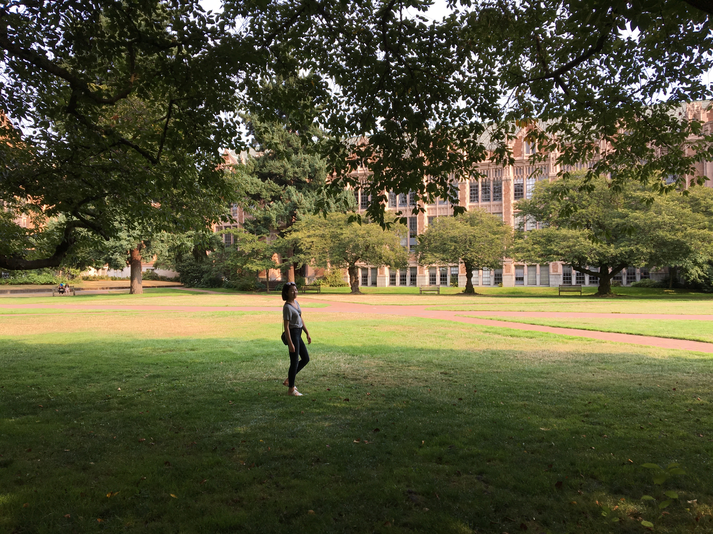

### Welcome to Yidie's repo
This is the repository of Yidie Feng for STAT545 HW.
- [HW01](https://github.com/yidie/STAT545-hw-Feng-Yidie/tree/master/hw01)
- [HW02](https://github.com/yidie/STAT545-hw-Feng-Yidie/tree/master/hw02)
- [HW03](https://github.com/yidie/STAT545-hw-Feng-Yidie/tree/master/hw03)
- [HW04](https://github.com/yidie/STAT545-hw-Feng-Yidie/tree/master/hw04)
- [HW05](https://github.com/yidie/STAT545-hw-Feng-Yidie/tree/master/hw05)
- [HW06](https://github.com/yidie/STAT545-hw-Feng-Yidie/tree/master/hw06)
- [HW07](https://github.com/yidie/STAT545-hw-Feng-Yidie/tree/master/hw07)
- [HW08](https://github.com/yidie/STAT545-hw-Feng-Yidie/tree/master/hw08)
- [HW09](https://github.com/yidie/Rpackage_foofactors)
- [HW10](https://github.com/yidie/STAT545-hw-Feng-Yidie/tree/master/hw10)

### Description about Myself
My name is Yidie Feng. I am from China. I got my Bachalor's degree in Statistics at UBC. And now I am a new Master student in Statistics.

### Photo of Myself

### My Goal for STAT 545
* Apply what I have learned from other statistics courses
* Improve my communication skills
* Get more pratice with coding in R
* Work with git and github with more confidence

### Report Process
1. I made these changes locally in R studio.
2. I save, commit, pull and push to github regularly.
3. Reflection 
- The sample readme file is helpful for beginners. 
- I still need to learn more about r markdown syntax.
- Practice more and make sure to follow the correct workflow.
