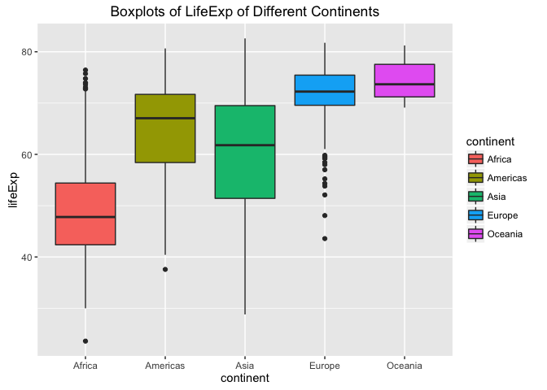

Explore Gapminder and use dplyr
================
Yidie Feng
9/24/2017

### Bring rectangular data in

``` r
library(gapminder)
library(tidyverse)
```

    ## Warning: package 'tidyverse' was built under R version 3.3.2

    ## Loading tidyverse: ggplot2
    ## Loading tidyverse: tibble
    ## Loading tidyverse: tidyr
    ## Loading tidyverse: readr
    ## Loading tidyverse: purrr
    ## Loading tidyverse: dplyr

    ## Warning: package 'tidyr' was built under R version 3.3.2

    ## Warning: package 'readr' was built under R version 3.3.2

    ## Warning: package 'purrr' was built under R version 3.3.2

    ## Conflicts with tidy packages ----------------------------------------------

    ## filter(): dplyr, stats
    ## lag():    dplyr, stats

### Smell test the data

``` r
str(gapminder)
```

    ## Classes 'tbl_df', 'tbl' and 'data.frame':    1704 obs. of  6 variables:
    ##  $ country  : Factor w/ 142 levels "Afghanistan",..: 1 1 1 1 1 1 1 1 1 1 ...
    ##  $ continent: Factor w/ 5 levels "Africa","Americas",..: 3 3 3 3 3 3 3 3 3 3 ...
    ##  $ year     : int  1952 1957 1962 1967 1972 1977 1982 1987 1992 1997 ...
    ##  $ lifeExp  : num  28.8 30.3 32 34 36.1 ...
    ##  $ pop      : int  8425333 9240934 10267083 11537966 13079460 14880372 12881816 13867957 16317921 22227415 ...
    ##  $ gdpPercap: num  779 821 853 836 740 ...

``` r
typeof(gapminder)
```

    ## [1] "list"

-   It is a dataframe and a list.

-   Its class is tibble/dataframe.

``` r
ncol(gapminder)
```

    ## [1] 6

-   There are 6 variables/columns. We can get this in the output of str() or ncol().

``` r
nrow(gapminder)
```

    ## [1] 1704

-   There are 1704 rows/observations. We can get this in the output of str() or nrow().

-   Yes. We can use str(), ncol(), nrow(), dim() etc. to find the extent and size of the dataframe.

-   Different functions can be useful depending on what we want to know. If we only want to know the number of rows/columns, nrow() and ncol() might be the most straightforward funtion. Sometimes, we might want to know more than just the number, then str() might be more useful since it tells us more such as the class of each variable and what the entries look like for each variable.

``` r
sapply(gapminder,typeof)
```

    ##   country continent      year   lifeExp       pop gdpPercap 
    ## "integer" "integer" "integer"  "double" "integer"  "double"

-   Country is integer. Continent is integer. Year is integer. LifeExp is double. Pop is integer. GdpPercap is double.

### Explore individual variables

1.  Categorical variable: continent

``` r
levels(gapminder$continent)
```

    ## [1] "Africa"   "Americas" "Asia"     "Europe"   "Oceania"

-   The possible values of continent are Africa, Americas, Asia, Europe and Oceania.

``` r
table(gapminder$continent)
```

    ## 
    ##   Africa Americas     Asia   Europe  Oceania 
    ##      624      300      396      360       24

``` r
barplot(table(gapminder$continent))
```

 - From the table, we know that Africa has the most observations(624) and Oceania has the least observations(24). The barplot if a graphical way to display such categorical data. It gives us the same information visually.

1.  Quantitative variable: LifeExp

``` r
summary(gapminder$lifeExp)
```

    ##    Min. 1st Qu.  Median    Mean 3rd Qu.    Max. 
    ##   23.60   48.20   60.71   59.47   70.85   82.60

``` r
summarise(gapminder, mean_le=mean(lifeExp), sd_le=sd(lifeExp))
```

    ## # A tibble: 1 × 2
    ##    mean_le    sd_le
    ##      <dbl>    <dbl>
    ## 1 59.47444 12.91711

``` r
hist(gapminder$lifeExp)
```

 - From the above code, we know that the minimum lifeExp is 23.6 and maximum is 82.6. We also know that the median is 60.71 and the mean is 59.47. The sd(12.92) tells us about the spread of lifeExp. The histogram indicates that values between 70 and 75 are typical since the frequency of lifeExp in this range is the highest. And the distribution is left-skewed.

### Explore various plot types & Use dplyr functions

``` r
gapminder %>%
  filter(country == "China") %>%
  ggplot(aes(x=year, y=gdpPercap)) + geom_point() + ggtitle("Scatterplot of GDP in China from 1952 to 2007") + xlab("Year") + ylab("GDP per capita")
```

 - This is a scatterplot of China's gdpPercap vs year. There is an overall incrasing trend. As time goes, the gdpPercap in China increases. And the biggest jump is from 2002 to 2007.

``` r
gapminder %>%
  filter(country == "China"|country == "Canada") %>%
  ggplot(aes(x=year, y=gdpPercap, color=country)) + geom_point() + ggtitle("Scatterplot of GDP in China vs Canada from 1952 to 2007") + xlab("Year") + ylab("GDP per capita")
```

 - This plot compares the gdpPercap between Canada and China over the period of 1952-2007. We can see that both countries' gdp increase as time goes. But the gdp of Canada is higher than that of China in each year measured.

``` r
gapminder %>%
  filter(country == "China"|country == "Canada") %>%
  ggplot(aes(x=lifeExp)) + geom_density(aes(group=country, colour=country, fill=country), alpha=0.3) + ggtitle("Density Plots of LifeExp in China vs Canada")
```

 - This plot shows that the distribution of lifeExp in Canada is centered around 75, while the distribution of lifeExp in China is centered around 65 with a larger spread compared to that of Canada.

``` r
gapminder %>%
  filter(continent == "Americas") %>%
  ggplot(aes(x=lifeExp)) + geom_density(aes(group=country, colour=country, fill=country), alpha=0.3)
```

 - This is a plot I tried. It shows the desity plots of lifeExp for all the countries in continent "Americas". But it is **NOT** useful since there are too many countries to display. With the densities overlapping, it is not informative.

``` r
gapminder %>%
  ggplot(aes(x=continent, y=lifeExp, fill=continent)) + geom_boxplot() + ggtitle("Boxplots of LifeExp of Different Continents")
```

 - This one shows the boxplots of lifeExp for different continents. We observe that Oceania has the highest mean lifeExp, while Afica has the lowest mean lifeExp. And Asia has the largest variation in lifeExp among the five continents. Moreover, Europe has a lot of outliers.

``` r
gapminder %>%
  filter(country %in% c("Spain", "Brazil"), year %in% 1997:2007) %>%
  select(country, lifeExp, gdpPercap) %>%
  ggplot(aes(x=lifeExp, y=gdpPercap, colour=country)) + geom_point() + ggtitle("GDP vs lifeExp in Spain and Brazil from 1997 to 2007")
```

 - I created a subset of the data using filter and select. And then I plot the data points in my subset. It shows that the gdp tends to increase as lifeExp increase in these three years for both countries. And Spain has larger gdpPercap and lifeExp than Brazil in these three years.
