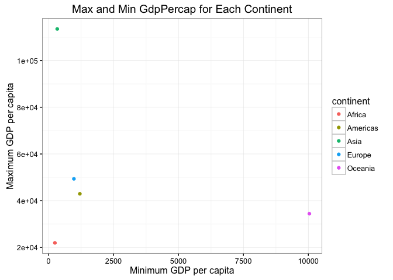
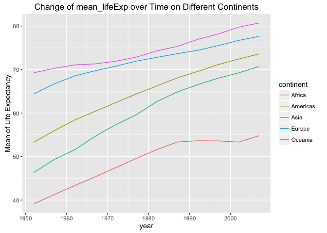

hw03\_use\_dplyr&ggplot\_to\_manipulate\_and\_explore\_data
================
Yidie Feng
9/30/2017

``` r
library(gapminder)
library(tidyverse)
```

    ## Warning: package 'tidyverse' was built under R version 3.3.2

    ## Loading tidyverse: ggplot2
    ## Loading tidyverse: tibble
    ## Loading tidyverse: tidyr
    ## Loading tidyverse: readr
    ## Loading tidyverse: purrr
    ## Loading tidyverse: dplyr

    ## Warning: package 'tidyr' was built under R version 3.3.2

    ## Warning: package 'readr' was built under R version 3.3.2

    ## Warning: package 'purrr' was built under R version 3.3.2

    ## Conflicts with tidy packages ----------------------------------------------

    ## filter(): dplyr, stats
    ## lag():    dplyr, stats

### Task1: Get the maximum and minimum of GDP per capita for all continents

-   Get the max and min gdpPercap for all continents

``` r
a <- gapminder %>%
  group_by(continent) %>%
  summarise(max_gdp = max(gdpPercap), min_gdp = min(gdpPercap))
```

-   Make a table. From the table, we know that Aisa has the highest max\_gdp and Africa has the lowest max\_gdp. Oceania has the highest min\_gdp and Africa has the lowest min\_gdp.

``` r
knitr::kable(a)
```

| continent |   max\_gdp|    min\_gdp|
|:----------|----------:|-----------:|
| Africa    |   21951.21|    241.1659|
| Americas  |   42951.65|   1201.6372|
| Asia      |  113523.13|    331.0000|
| Europe    |   49357.19|    973.5332|
| Oceania   |   34435.37|  10039.5956|

-   From the graph, Asia outperforms other continents because it has the highest max\_gdp and a relatively low min\_gdp. While Africa has both lowest max\_gdp and lowest min\_gdp. It shows the same thing as that in the table but from a visual perspective.

``` r
ggplot(a, aes(min_gdp, max_gdp)) + 
  geom_point(aes(colour = continent)) +
  theme_bw() +
  labs(x="Minimum GDP per capita",
       y="Maximum GDP per capita",
       title="Max and Min GdpPercap for Each Continent")
```



### Task 2: Look at the spread of GDP per capita within the continents

-   Get the gdpPercap data for each continent

``` r
b <- gapminder %>% 
  select(gdpPercap, continent) %>%
  group_by(continent) %>%
  summarise(sd_gdp = sd(gdpPercap))
```

-   Make a table. The table shows that Asia has a large standard deviation, which means the spread of gdpPercap in Asia is large. Americas and Oceania have similiar spread. Africa has the smallest spread in terms of gdpPercap.

``` r
knitr::kable(b)
```

| continent |    sd\_gdp|
|:----------|----------:|
| Africa    |   2827.930|
| Americas  |   6396.764|
| Asia      |  14045.373|
| Europe    |   9355.213|
| Oceania   |   6358.983|

-   A boxplot of gdpPercap for each continent. From the graph, indeed, Asia has the most variation given that there are a lot of outliers.

``` r
ggplot(gapminder, aes(x=continent, y=gdpPercap, fill=continent)) + 
  geom_boxplot() +
  labs(y="GDP per capita",
       title="Boxplot of GdpPercap for Each Continent")
```


### Task 3: How is life expectancy changing over time on different continents?

-   Compute the lifeExp averaged over all the countries of each continent in each year

``` r
c <- gapminder %>%
  group_by(continent, year) %>%
  summarise(mean_lifeExp = mean(lifeExp))
```

-   Make a table. We observe that the lifeExp increases over time for all the continents.

``` r
knitr::kable(c)
```

| continent |  year|  mean\_lifeExp|
|:----------|-----:|--------------:|
| Africa    |  1952|       39.13550|
| Africa    |  1957|       41.26635|
| Africa    |  1962|       43.31944|
| Africa    |  1967|       45.33454|
| Africa    |  1972|       47.45094|
| Africa    |  1977|       49.58042|
| Africa    |  1982|       51.59287|
| Africa    |  1987|       53.34479|
| Africa    |  1992|       53.62958|
| Africa    |  1997|       53.59827|
| Africa    |  2002|       53.32523|
| Africa    |  2007|       54.80604|
| Americas  |  1952|       53.27984|
| Americas  |  1957|       55.96028|
| Americas  |  1962|       58.39876|
| Americas  |  1967|       60.41092|
| Americas  |  1972|       62.39492|
| Americas  |  1977|       64.39156|
| Americas  |  1982|       66.22884|
| Americas  |  1987|       68.09072|
| Americas  |  1992|       69.56836|
| Americas  |  1997|       71.15048|
| Americas  |  2002|       72.42204|
| Americas  |  2007|       73.60812|
| Asia      |  1952|       46.31439|
| Asia      |  1957|       49.31854|
| Asia      |  1962|       51.56322|
| Asia      |  1967|       54.66364|
| Asia      |  1972|       57.31927|
| Asia      |  1977|       59.61056|
| Asia      |  1982|       62.61794|
| Asia      |  1987|       64.85118|
| Asia      |  1992|       66.53721|
| Asia      |  1997|       68.02052|
| Asia      |  2002|       69.23388|
| Asia      |  2007|       70.72848|
| Europe    |  1952|       64.40850|
| Europe    |  1957|       66.70307|
| Europe    |  1962|       68.53923|
| Europe    |  1967|       69.73760|
| Europe    |  1972|       70.77503|
| Europe    |  1977|       71.93777|
| Europe    |  1982|       72.80640|
| Europe    |  1987|       73.64217|
| Europe    |  1992|       74.44010|
| Europe    |  1997|       75.50517|
| Europe    |  2002|       76.70060|
| Europe    |  2007|       77.64860|
| Oceania   |  1952|       69.25500|
| Oceania   |  1957|       70.29500|
| Oceania   |  1962|       71.08500|
| Oceania   |  1967|       71.31000|
| Oceania   |  1972|       71.91000|
| Oceania   |  1977|       72.85500|
| Oceania   |  1982|       74.29000|
| Oceania   |  1987|       75.32000|
| Oceania   |  1992|       76.94500|
| Oceania   |  1997|       78.19000|
| Oceania   |  2002|       79.74000|
| Oceania   |  2007|       80.71950|

-   This graph plots the mean\_lifeExp over time for all the continents and connect the points over time for each continent. It shows that every continent's mean\_lifeExp is increasing over time. It is interesting that the mean\_lifeExp of Africa stays around the same value from year 1990 to 2000, shown by the flatness of the graph during that period.

``` r
ggplot(c, aes(year, mean_lifeExp, colour=continent)) + 
  geom_line() +
  labs(y="Mean of Life Expectancy",
    title = "Change of mean_lifeExp over Time on Different Continents")
```



-   This graph uses the geom\_smooth function and fits a linear model between year and life\_Exp for each continent. Compared to the previous graph, every line is smooth here. But it shows the same trend for each continent: lifeExp is incresing over time.

``` r
ggplot(gapminder, aes(year, lifeExp, colour=continent)) + 
  geom_smooth(method="lm", se=FALSE) +
  labs(y="Life Expectancy",
    title = "Change of lifeExp over Time on Different Continents")
```


