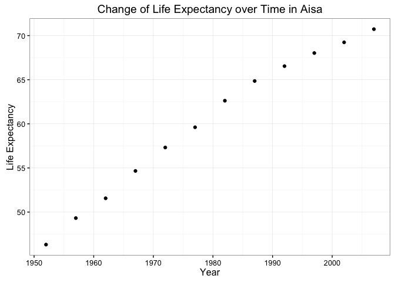
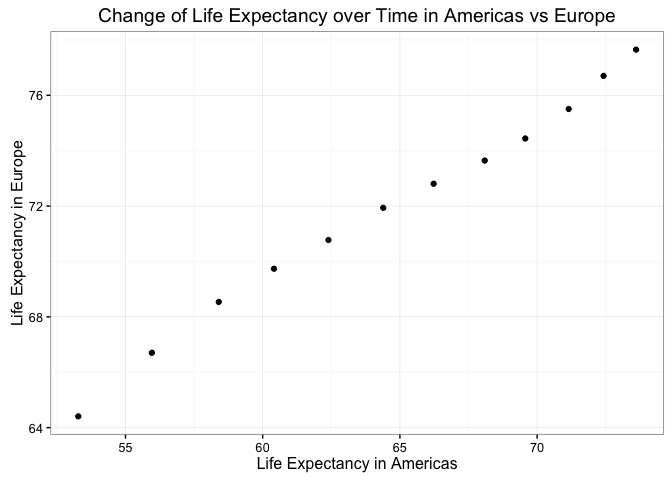

Tidy data and joins
================
Yidie Feng
10/9/2017

``` r
library(gapminder)
library(tidyverse)
```

    ## Warning: package 'tidyverse' was built under R version 3.3.2

    ## Loading tidyverse: ggplot2
    ## Loading tidyverse: tibble
    ## Loading tidyverse: tidyr
    ## Loading tidyverse: readr
    ## Loading tidyverse: purrr
    ## Loading tidyverse: dplyr

    ## Warning: package 'tidyr' was built under R version 3.3.2

    ## Warning: package 'readr' was built under R version 3.3.2

    ## Warning: package 'purrr' was built under R version 3.3.2

    ## Conflicts with tidy packages ----------------------------------------------

    ## filter(): dplyr, stats
    ## lag():    dplyr, stats

``` r
library(ggplot2)
```

### General data reshaping and relationship to aggregation

Activity: Compute some measure of life expectancy (mean? median? min? max?) for all possible combinations of continent and year. Reshape that to have one row per year and one variable for each continent.

-   This is the usual form we get.

``` r
usual_shape <- gapminder %>%
  group_by(year,continent) %>%
  summarise(mean_lifeExp = mean(lifeExp))
```

-   This is the reshaped form by using 'spread()' function.

``` r
re_shape <- usual_shape %>%
  spread(key=continent, value=mean_lifeExp)

knitr::kable(re_shape)
```

|  year|    Africa|  Americas|      Asia|    Europe|  Oceania|
|-----:|---------:|---------:|---------:|---------:|--------:|
|  1952|  39.13550|  53.27984|  46.31439|  64.40850|  69.2550|
|  1957|  41.26635|  55.96028|  49.31854|  66.70307|  70.2950|
|  1962|  43.31944|  58.39876|  51.56322|  68.53923|  71.0850|
|  1967|  45.33454|  60.41092|  54.66364|  69.73760|  71.3100|
|  1972|  47.45094|  62.39492|  57.31927|  70.77503|  71.9100|
|  1977|  49.58042|  64.39156|  59.61056|  71.93777|  72.8550|
|  1982|  51.59287|  66.22884|  62.61794|  72.80640|  74.2900|
|  1987|  53.34479|  68.09072|  64.85118|  73.64217|  75.3200|
|  1992|  53.62958|  69.56836|  66.53721|  74.44010|  76.9450|
|  1997|  53.59827|  71.15048|  68.02052|  75.50517|  78.1900|
|  2002|  53.32523|  72.42204|  69.23388|  76.70060|  79.7400|
|  2007|  54.80604|  73.60812|  70.72848|  77.64860|  80.7195|

-   Is there a plot that is easier to make using the reshaped data versus the usual form?

1.  Yes. For example, we can easily plot the lifeExp over time for a certain continent by simply specifying the x axis to be the year, and y axis to be the continent we are interested in. While if the data is in the usual form, we will need to 'filter()' the continent we want before plotting.

``` r
ggplot(re_shape, aes(year, Asia)) +
  geom_point() +
  theme_bw() +
  labs(x="Year",
       y="Life Expectancy",
       title="Change of Life Expectancy over Time in Aisa")
```



1.  We can also plot the change of lifeExp over time between two continents by specifying, for example, the x axis to be Americas and y axis to be Europe. But I don't think this is a good way to do comparison. Because in the usual form, we can plot the continents we want to compare on the same graph but with different color, which is better for visualization than using the reshaped data.

``` r
ggplot(re_shape, aes(Americas, Europe)) +
  geom_point() +
  theme_bw() +
  labs(x="Life Expectancy in Americas",
       y="Life Expectancy in Europe",
       title="Change of Life Expectancy over Time in Americas vs Europe")
```



### Join, merge, look up

Activity: Create a second data frame, complementary to Gapminder. Join this with (part of) Gapminder using a dplyr join function and make some observations about the process and result. Explore the different types of joins.

-   Select five rows from gapminder dataset.

``` r
gapminder1<-gapminder[c(1,350,600,950,1100),]
gapminder1
```

    ## # A tibble: 5 × 6
    ##       country continent  year lifeExp      pop  gdpPercap
    ##        <fctr>    <fctr> <int>   <dbl>    <int>      <dbl>
    ## 1 Afghanistan      Asia  1952  28.801  8425333   779.4453
    ## 2  Costa Rica  Americas  1957  60.026  1112300  2990.0108
    ## 3      Greece    Europe  2007  79.483 10706290 27538.4119
    ## 4        Mali    Africa  1957  35.307  4241884   490.3822
    ## 5 New Zealand   Oceania  1987  74.320  3317166 19007.1913

-   Create a new dataframe.

``` r
country<-c("Afghanistan","Costa Rica","Greece","New Zealand","Chile")
hemisphere<-c("northern","northern","northern","southern","southern")
gapminder2<-data.frame(country,hemisphere)
gapminder2
```

    ##       country hemisphere
    ## 1 Afghanistan   northern
    ## 2  Costa Rica   northern
    ## 3      Greece   northern
    ## 4 New Zealand   southern
    ## 5       Chile   southern

-   We can see that 'left\_join()' keeps everything in gapminder1 and add hemisphere column to it. Since there is no hemisphere for Mali in gapminder2, it puts NA there.

``` r
left_join(gapminder1,gapminder2)
```

    ## Joining, by = "country"

    ## Warning in left_join_impl(x, y, by$x, by$y, suffix$x, suffix$y): joining
    ## factors with different levels, coercing to character vector

    ## # A tibble: 5 × 7
    ##       country continent  year lifeExp      pop  gdpPercap hemisphere
    ##         <chr>    <fctr> <int>   <dbl>    <int>      <dbl>     <fctr>
    ## 1 Afghanistan      Asia  1952  28.801  8425333   779.4453   northern
    ## 2  Costa Rica  Americas  1957  60.026  1112300  2990.0108   northern
    ## 3      Greece    Europe  2007  79.483 10706290 27538.4119   northern
    ## 4        Mali    Africa  1957  35.307  4241884   490.3822         NA
    ## 5 New Zealand   Oceania  1987  74.320  3317166 19007.1913   southern

-   We can see that 'inner\_join()' returns all the information possessed by the common countries appeared in both dataframes. Both dataframes have "Afghanistan", "Costa Rica", "Greece" and "New Zealand". So it returns these countries with the corresponding information from gapminder1 and gapminder2 .

``` r
inner_join(gapminder1,gapminder2)
```

    ## Joining, by = "country"

    ## Warning in inner_join_impl(x, y, by$x, by$y, suffix$x, suffix$y): joining
    ## factors with different levels, coercing to character vector

    ## # A tibble: 4 × 7
    ##       country continent  year lifeExp      pop  gdpPercap hemisphere
    ##         <chr>    <fctr> <int>   <dbl>    <int>      <dbl>     <fctr>
    ## 1 Afghanistan      Asia  1952  28.801  8425333   779.4453   northern
    ## 2  Costa Rica  Americas  1957  60.026  1112300  2990.0108   northern
    ## 3      Greece    Europe  2007  79.483 10706290 27538.4119   northern
    ## 4 New Zealand   Oceania  1987  74.320  3317166 19007.1913   southern

-   We can see that 'full\_join()' returns all the information in both dataframes.

``` r
full_join(gapminder1,gapminder2)
```

    ## Joining, by = "country"

    ## Warning in full_join_impl(x, y, by$x, by$y, suffix$x, suffix$y): joining
    ## factors with different levels, coercing to character vector

    ## # A tibble: 6 × 7
    ##       country continent  year lifeExp      pop  gdpPercap hemisphere
    ##         <chr>    <fctr> <int>   <dbl>    <int>      <dbl>     <fctr>
    ## 1 Afghanistan      Asia  1952  28.801  8425333   779.4453   northern
    ## 2  Costa Rica  Americas  1957  60.026  1112300  2990.0108   northern
    ## 3      Greece    Europe  2007  79.483 10706290 27538.4119   northern
    ## 4        Mali    Africa  1957  35.307  4241884   490.3822         NA
    ## 5 New Zealand   Oceania  1987  74.320  3317166 19007.1913   southern
    ## 6       Chile        NA    NA      NA       NA         NA   southern

-   We can see that 'semi\_join()' returns only the information in gapminder1 where there are matching countries in gapminder2. Only "Afghanistan", "Costa Rica", "Greece" and "New Zealand" are matched in gapminder2. So it returns the information for these countries from gapminder1.

``` r
semi_join(gapminder1,gapminder2)
```

    ## Joining, by = "country"

    ## # A tibble: 4 × 6
    ##       country continent  year lifeExp      pop  gdpPercap
    ##        <fctr>    <fctr> <int>   <dbl>    <int>      <dbl>
    ## 1 Afghanistan      Asia  1952  28.801  8425333   779.4453
    ## 2  Costa Rica  Americas  1957  60.026  1112300  2990.0108
    ## 3      Greece    Europe  2007  79.483 10706290 27538.4119
    ## 4 New Zealand   Oceania  1987  74.320  3317166 19007.1913

-   We can see that 'anti\_join()' returns the information in gapminder1 where there are no matching in gapminder2. "Mali" is not present in gapminder2. So it returns Mali's information from gapminder1.

``` r
anti_join(gapminder1,gapminder2)
```

    ## Joining, by = "country"

    ## # A tibble: 1 × 6
    ##   country continent  year lifeExp     pop gdpPercap
    ##    <fctr>    <fctr> <int>   <dbl>   <int>     <dbl>
    ## 1    Mali    Africa  1957  35.307 4241884  490.3822

Note: My process report is in README.
