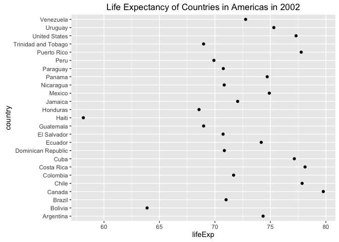
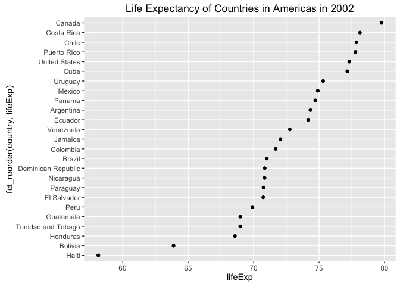
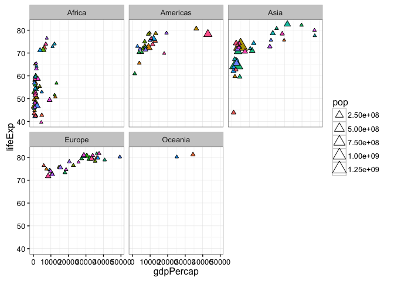

Factor and figure management; Repo hygiene
================
Yidie Feng
10/12/2017

``` r
library(gapminder)
library(dplyr)
library(ggplot2)
library(tidyverse)
library(forcats)
library(RColorBrewer)
```

### Factor Management (Gapminder Version)

-   Remove observations associated with Oceania and drop the unused level.

``` r
gapminder2 <- gapminder %>%
  filter(continent != "Oceania") %>%
  droplevels()
```

-   Now we investigate the data before and after removing the rows associated with Oceania.

Before, there are five levels of factor `continent`: "Africa", "Americas", "Asia", "Europe" and "Oceania". After, there are four levels of factor `continent`: "Africa", "Americas", "Asia" and "Europe".

``` r
levels(gapminder$continent)
```

    ## [1] "Africa"   "Americas" "Asia"     "Europe"   "Oceania"

``` r
nlevels(gapminder$continent)
```

    ## [1] 5

``` r
levels(gapminder2$continent)
```

    ## [1] "Africa"   "Americas" "Asia"     "Europe"

``` r
nlevels(gapminder2$continent)
```

    ## [1] 4

Before, there are 1704 rows. After, there are 1680 rows.

``` r
nrow(gapminder)
```

    ## [1] 1704

``` r
nrow(gapminder2)
```

    ## [1] 1680

-   Reorder the levels of `country` or `continent`. I will reorder the levels of continent according to mean of lifeExp in descending order.

``` r
fct_reorder(gapminder$continent, gapminder$lifeExp, mean, .desc = TRUE) %>% 
  levels() %>% head()
```

    ## [1] "Oceania"  "Europe"   "Americas" "Asia"     "Africa"

-   Explore the effects of arrange(). Does merely arranging the data have any effect on, say, a figure? My answer is no by looking at the following two plots. After I `arrange()` gapminder by lifeExp and then plot, it is the same as the plot without arranging. So merely arranging the data does not affect a figure. By looking at the output of `levels()` function, we can see that the levels of country stay the same after arranging.

This is a subset of gapminder which has the data for Americas in 2002.

``` r
gap_america_2002 <- gapminder %>% filter(year == 2002, continent == "Americas")
```

This is a plot of lifeExp for all the countries in gap\_america\_2002.

``` r
gap_america_2002 %>%
  ggplot(aes(x = lifeExp, y = country)) + 
  geom_point() +
  labs(title="Life Expectancy of Countries in Americas in 2002")
```



``` r
head(gap_america_2002)
```

    ## # A tibble: 6 × 6
    ##     country continent  year lifeExp       pop gdpPercap
    ##      <fctr>    <fctr> <int>   <dbl>     <int>     <dbl>
    ## 1 Argentina  Americas  2002  74.340  38331121  8797.641
    ## 2   Bolivia  Americas  2002  63.883   8445134  3413.263
    ## 3    Brazil  Americas  2002  71.006 179914212  8131.213
    ## 4    Canada  Americas  2002  79.770  31902268 33328.965
    ## 5     Chile  Americas  2002  77.860  15497046 10778.784
    ## 6  Colombia  Americas  2002  71.682  41008227  5755.260

``` r
head(levels(gap_america_2002$country))
```

    ## [1] "Afghanistan" "Albania"     "Algeria"     "Angola"      "Argentina"  
    ## [6] "Australia"

We *arrange* the data by lifeExp and then plot.

``` r
a<- gap_america_2002 %>%
  arrange(lifeExp)
  
ggplot(a, aes(x = lifeExp, y = country)) +
  geom_point() +
  labs(title="Life Expectancy of Countries in Americas in 2002") 
```


``` r
head(levels(a$country))
```

    ## [1] "Afghanistan" "Albania"     "Algeria"     "Angola"      "Argentina"  
    ## [6] "Australia"

-   Explore the effects of reordering a factor and factor reordering coupled with arrange(). Especially, what effect does this have on a figure? From the following plots, we can see that `reorder()` does have an effect on how the figure looks. After I reorder the levels of country by lifeExp and then plot, the countries on the y-axis appear to have order from lowest lifeExp to highest lifeExp when viewed from bottom to top. And `reorder()` coupled with `arrange()` gives us the same plot as only using `reorder()`, since `arrange()` does not really affect the figure, as explored in the previous question.

We *reorder* the levels of country by lifeExp and then plot.

``` r
gap_america_2002 %>%
  ggplot(aes(x = lifeExp, y = fct_reorder(country, lifeExp))) +
  geom_point() +
  labs(title="Life Expectancy of Countries in Americas in 2002")
```



We *reorder coupled with arrange* the levels of country by lifeExp and then plot.

``` r
gap_america_2002 %>%
  arrange(lifeExp) %>%
  ggplot(aes(x = lifeExp, y = fct_reorder(country, lifeExp))) +
  geom_point() +
  labs(title="Life Expectancy of Countries in Americas in 2002")
```


### File I/O

Bring rectangular data in using `read_tsv()`

``` r
gap_tsv <- system.file("gapminder.tsv", package = "gapminder")
gapminder <- read_tsv(gap_tsv)
```

    ## Parsed with column specification:
    ## cols(
    ##   country = col_character(),
    ##   continent = col_character(),
    ##   year = col_integer(),
    ##   lifeExp = col_double(),
    ##   pop = col_integer(),
    ##   gdpPercap = col_double()
    ## )

``` r
# change continent and country to factors
gapminder <- gapminder %>%
  mutate(country = factor(country),
         continent = factor(continent))
```

Compute something worthy of export. Here I will compute the mean of gdpPercap for each country.

``` r
gap_mean_gdp <- gapminder %>%
  group_by(country) %>%
  summarise(mean_gdp = mean(gdpPercap))
```

Then I will write `gap_mean_gdp` out to get a comma-delimited file. Now we have a file called "gap\_mean\_gdp.csv" saved in the current working directory.

``` r
write_csv(gap_mean_gdp, "gap_mean_gdp.csv")
gap_via_csv <- read_csv("gap_mean_gdp.csv")
```

    ## Parsed with column specification:
    ## cols(
    ##   country = col_character(),
    ##   mean_gdp = col_double()
    ## )

``` r
gap_via_csv$country <- as_factor(gap_via_csv$country)
```

Reorder the levels of country in increasing order of mean gdp. We can see that the levels of country are changed (starting from "Myanmar").

``` r
head(levels(gap_mean_gdp$country))
```

    ## [1] "Afghanistan" "Albania"     "Algeria"     "Angola"      "Argentina"  
    ## [6] "Australia"

``` r
gap_mean_gdp <- gap_mean_gdp %>% 
  mutate(country = fct_reorder(country, mean_gdp))

head(levels(gap_mean_gdp$country))
```

    ## [1] "Myanmar"    "Burundi"    "Ethiopia"   "Eritrea"    "Mozambique"
    ## [6] "Malawi"

Note that the ordered country levels are maintained with`saveRDS()/readRDS()`

``` r
saveRDS(gap_mean_gdp, "gap_mean_gdp.rds") 
gap_via_rds<-readRDS("gap_mean_gdp.rds")
head(levels(gap_via_rds$country))  
```

    ## [1] "Myanmar"    "Burundi"    "Ethiopia"   "Eritrea"    "Mozambique"
    ## [6] "Malawi"

`dput()` creates an R-specific-but-not-binary representation.

``` r
dput(gap_via_rds, "gap_mean_gdp_dput.txt")
```

We can look at "gap\_mean\_gdp\_dput.txt" to get a sense of what it looks like. The function `dget()` reads the representation back in to our usual data form.

``` r
gap_via_dget<-dget( "gap_mean_gdp_dput.txt")
```

I will summarize in a table whether the country levels survive through these different write/read functions.

This is the country levels stored in `gap_mean_gdp` which has been reordered.

``` r
country_levels <- tibble(original = head(levels(gap_mean_gdp$country)))
country_levels
```

    ## # A tibble: 6 × 1
    ##     original
    ##        <chr>
    ## 1    Myanmar
    ## 2    Burundi
    ## 3   Ethiopia
    ## 4    Eritrea
    ## 5 Mozambique
    ## 6     Malawi

Add columns for country levels stored in each of .csv/.rds/dput.txt files. We can see that *csv* gives us alphabetic order. While *rds* and *dput* can maintain the ordered levels.

``` r
country_levels<-country_levels %>%
  mutate(levels_via_csv = head(levels(gap_via_csv$country)),
         levels_via_rds = head(levels(gap_via_rds$country)),
         levels_via_dput = head(levels(gap_via_dget$country)))

knitr::kable(country_levels)
```

| original   | levels\_via\_csv | levels\_via\_rds | levels\_via\_dput |
|:-----------|:-----------------|:-----------------|:------------------|
| Myanmar    | Afghanistan      | Myanmar          | Myanmar           |
| Burundi    | Albania          | Burundi          | Burundi           |
| Ethiopia   | Algeria          | Ethiopia         | Ethiopia          |
| Eritrea    | Angola           | Eritrea          | Eritrea           |
| Mozambique | Argentina        | Mozambique       | Mozambique        |
| Malawi     | Australia        | Malawi           | Malawi            |

### Visualization design

I will make two figure using what we learned in recent classes.

``` r
p1<- gapminder %>%
  filter(year==2007, pop>80000)%>%
  ggplot(aes(gdpPercap, lifeExp)) +
  geom_point(aes(size=pop, fill=country), shape=24) +
  theme_bw() +
  facet_wrap(~continent) +
  scale_color_manual() +
  guides(fill=F)

p1
```



### Writing figures to file

Show a situation where argument p matters. Create another figure

``` r
p2<-gapminder %>%
  filter(country == "China"|country == "Canada") %>%
  ggplot(aes(x=lifeExp)) + 
  geom_density(aes(group=country, colour=country, fill=country), alpha=0.3) 
```

If I want to save p1, I will need to specify "plot=" argument in `ggsave()` because by default it will save the last plot display which is p2. There are also arguments like width/height/dpi that we can specify.

``` r
ggsave("p2.png", width=40, height=40, dpi=400, )
ggsave("p1.png", plot=p1)
```

    ## Saving 7 x 5 in image

Embed the two figures:  

NOTE: Process report is [here]().
