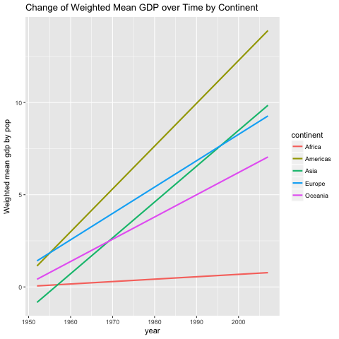
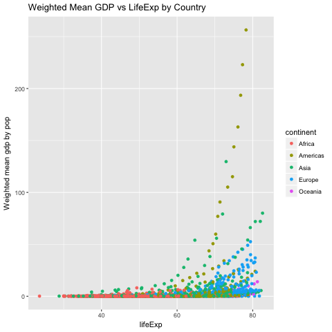

### Summary
This is how remake works: in [remake.yml](https://github.com/yidie/STAT545-hw-Feng-Yidie/blob/master/hw07/remake.yml), we will call the functions defined in [code.R](https://github.com/yidie/STAT545-hw-Feng-Yidie/blob/master/hw07/code.R) to generate all the targets and automate the pipeline. Refer to those two files to see more detailed step-by-step explanation.

### Processed Data
This is what the processed gapminder data looks like.
```{r}
knitr::kable(head(read.csv("summary_dat.csv")))
```

### Figures
Below are the two figures generated from the analysis from the functions `plot_gdp_year()` and `plot_gdp_lifeExp()` respectively.





### Dependency Diagram
`remake::diagram()` will generate the dependency diagram based on the `remake.yml` file, which is super convenient. From this diagram viewing backwards, we can see that our final product `report.html` depends on the two figures and `report.md`. And the two figures depend on `processed_gapminder_data`, which depends on `gapminder_df`, which depends on `gapminder.tsv`. In other words, we first download `gapminder.tsv` using the function `downl_tsv()`. Then we read it in and call it `gapminder_df`. Then we mutate `gapminder_df` to have `weighted_mean_gdp` using the function `process_data()`and call the mutated dataframe `processed_gapminder_data`. Then we creat two plots based on the `processed_gapminder_data` using `plot_gdp_year()` and `plot_gdp_lifeExp()` functions, which together with `report.md` will produce the final `report.html`.
```{r, warning=FALSE, message=FALSE}
remake::diagram(remake_file = "remake.yml")
```

