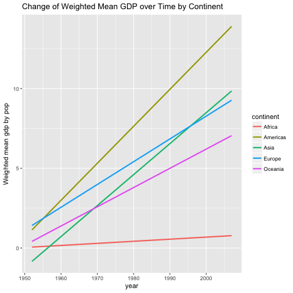
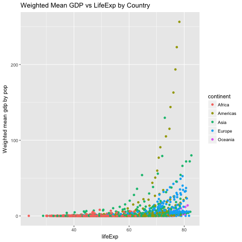

# Report
Yidie Feng  
11/14/2017  
### Summary
For this assignment, I did _remake_ to automate data analysis pipelines.
- This is the (remake.yml)[https://github.com/yidie/STAT545-hw-Feng-Yidie/blob/master/hw07/remake.yml] file which have all the targets and dependencies. And I explained every step in the file with comments.
- This is the (code.R)[https://github.com/yidie/STAT545-hw-Feng-Yidie/blob/master/hw07/code.R] file which contains all the functions/rules that will relate the targets together. And I explained every step in the file with comments.
- This is how it works: in remake.yml, we will call the functions defined in code.R to generate all the targets and automate the pipeline. Refer to those two files to see more detailed explanation.

### Processed Data
This is what the processed gapminder data looks like.

```r
knitr::kable(head(read.csv("summary_dat.csv")))
```


  X  country       continent    year   lifeExp        pop   gdpPercap      newpop      weight   weighted_mean_gdp
---  ------------  ----------  -----  --------  ---------  ----------  ----------  ----------  ------------------
  1  Afghanistan   Asia         1952    28.801    8425333    779.4453   0.8425333   0.0001670           0.1301948
  2  Afghanistan   Asia         1957    30.332    9240934    820.8530   0.9240934   0.0001832           0.1503842
  3  Afghanistan   Asia         1962    31.997   10267083    853.1007   1.0267083   0.0002035           0.1736474
  4  Afghanistan   Asia         1967    34.020   11537966    836.1971   1.1537966   0.0002287           0.1912753
  5  Afghanistan   Asia         1972    36.088   13079460    739.9811   1.3079460   0.0002593           0.1918807
  6  Afghanistan   Asia         1977    38.438   14880372    786.1134   1.4880372   0.0002950           0.2319102

### Figures





### Dependency Diagram
`remake::diagram()` will generate the dependency diagram based on the `remake.yml` file, which is super convenient. From this diagram viewing backwards, we can see that our final product `report.html` depends on the two figures and `report.md`. And the two figures depend on `processed_gapminder_data`, which depends on `gapminder_df`, which depends on `gapminder.tsv`. In other words, we first download `gapminder.tsv` using the function `downl_tsv()`. Then we read it in and call it `gapminder_df`. Then we mutate `gapminder_df` to have `weighted_mean_gdp` using the function `process_data()`and call the mutated dataframe `processed_gapminder_data`. Then we creat two plots based on the `processed_gapminder_data` using `plot_gdp_year()` and `plot_gdp_lifeExp()` functions, which together with `report.md` will produce the final `report.html`.

```r
remake::diagram(remake_file = "remake.yml")
```

<!--html_preserve--><div id="htmlwidget-e805307403c1fbdba958" style="width:672px;height:480px;" class="grViz html-widget"></div>
<script type="application/json" data-for="htmlwidget-e805307403c1fbdba958">{"x":{"diagram":"digraph remake { node [ fontname = courier, fontsize = 10 ] \nnode [ shape = circle, color = \"#34495e\", fillcolor = \"#D6DBDF\", style = filled ] \"all\"\nnode [ shape = box, color = \"#d35400\", fillcolor = \"#d35400\", style = filled ] \"gapminder.tsv\"\nnode [ shape = ellipse, color = \"#3498db\", fillcolor = \"#3498db\", style = filled ] \"gapminder_df\"; \"processed_gapminder_data\"\nnode [ shape = box, color = \"#f1c40f\", fillcolor = \"#f1c40f\", style = filled ] \"figures/weighted_mean_gdp_by_continent.png\"; \"figures/weighted_mean_gdp_lifeExp.png\"\nnode [ shape = box, color = \"#d35400\", fillcolor = \"#F6DDCC\", style = filled ] \"report.html\"\nnode [ shape = box, color = \"#1abc9c\", fillcolor = \"#1abc9c\", style = filled ] \"report.Rmd\"\n\"gapminder.tsv\" -> \"gapminder_df\" [tooltip = \"read.delim\"];\n\"gapminder_df\" -> \"processed_gapminder_data\" [tooltip = \"process_data\"];\n\"processed_gapminder_data\" -> \"figures/weighted_mean_gdp_by_continent.png\" [tooltip = \"plot_gdp_year\"];\n\"processed_gapminder_data\" -> \"figures/weighted_mean_gdp_lifeExp.png\" [tooltip = \"plot_gdp_lifeExp\"];\n\"figures/weighted_mean_gdp_by_continent.png\" -> \"report.html\" [tooltip = \"render\"];\n\"figures/weighted_mean_gdp_lifeExp.png\" -> \"report.html\" [tooltip = \"render\"];\n\"report.html\" -> \"all\" [tooltip = \"(dependency only)\"];\n\"report.Rmd\" -> \"report.html\" [tooltip = \"render\"]; }","config":{"engine":"dot","options":null}},"evals":[],"jsHooks":[]}</script><!--/html_preserve-->
